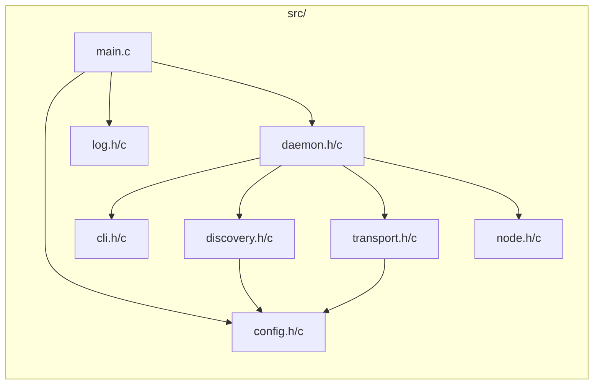

# DESIGN.md

```
Статус: В разработке
Версия: 0.4.0
```

## 1. Суть

P2P-чат без сервера. Узлы сами находят друг друга (UDP), проверяют сертификаты (mTLS), общаются напрямую (TCP). Zero-Hop: сообщение идёт напрямую, без ретрансляции через соседей.

## 2. Модули (8 файлов)

```text
main.c → config → log → daemon → discovery (UDP)
                               → transport (TCP+TLS)
                               → node      (реестр)
                               → cli       (команды)
```

| Модуль | Файл | Назначение |
|--------|------|------------|
| Точка входа | `main.c` | Загрузка конфига, запуск |
| Конфигурация | `config.h/c` | Чтение `.conf` файла |
| Логирование | `log.h/c` | Уровни DEBUG..FATAL, файл/консоль |
| CLI | `cli.h/c` | Регистрация и вызов команд |
| Демон | `daemon.h/c` | Главный цикл `epoll` |
| Обнаружение | `discovery.h/c` | UDP Multicast HELLO |
| Транспорт | `transport.h/c` | TCP + TLS + send/recv |
| Реестр | `node.h/c` | Учёт узлов: fp, name, fd |

---



## 3. Ключевые решения

| Вопрос | Решение | Почему |
|--------|---------|--------|
| Идентификация | SHA256 сертификата | Нельзя подделать, не нужно настраивать |
| Короткое имя | В конфиге, передаётся в HELLO | `/msg alice` вместо `/msg a1b2c3...` |
| Формат сообщений | `текст\n` | Простота, читаемо в tcpdump |
| Буферы | Статические | Нет malloc в горячем пути |
| Потоки | Один + epoll | Нет гонок, нет мьютексов |
| BYE | Нет | Разрыв TCP = узел ушёл |

## 4. Безопасность

```
HELLO (UDP, открыто):
  {"fp":"sha256...", "name":"alice", "p":12345}

Подключение (TCP):
  mTLS → проверка rootCA → SHA256(cert) == fp из HELLO ?
```

Двойная проверка: TLS-верификация + сверка fingerprint. Имя — для удобства, решение о доверии — по fingerprint.

## 5. Конфигурация

```ini
[network]
multicast_addr = 239.255.0.1
multicast_port = 9000
hello_interval = 5

[identity]
name = alice

[security]
ca_cert  = certs/rootCA.crt
my_cert  = certs/client.crt
my_key   = certs/client.key

[logging]
level   = info
console = yes
file    = p2pchat.log
```

## 6. Требования к сборке (строгие флаги)

Сборка должна выполняться с дополнительными флагами компиляции для повышения качества и безопасности кода:

- `-Wpedantic` — строгое следование стандарту ISO C
- `-Werror` — трактовать все предупреждения как ошибки
- `-Wformat=2` — проверка форматных строк printf/scanf на соответствие типам
- `-Wsign-conversion` — предупреждения о неявных преобразованиях знаковых/беззнаковых типов
- `-Wcast-align` — предупреждения о приведении указателей, нарушающих выравнивание

Код должен компилироваться без ошибок и предупреждений при включённых данных флагах.

## 7. Ограничения и допущения

Следующие ограничения осознанно заложены в архитектуру. Они упрощают код, исключают 
гонки и динамическое выделение памяти. Могут быть пересмотрены в будущих версиях.

### Память и буферы
1. **Статические буферы фиксированного размера** — все буферы выделяются на этапе компиляции. `malloc`/`free` в горячем пути отсутствуют. При превышении размера сообщение обрезается или отбрасывается.

### Потоки и конкурентность
2. **Один поток + epoll** — весь ввод-вывод (UDP, TCP, TLS, stdin) обрабатывается в одном потоке. Нет мьютексов, нет гонок. Ценой является блокировка на длительных операциях (например, чтение большого файла с диска).

### Сеть и узлы
3. **Локальная сеть** — узлы должны находиться в одном multicast-домене. Маршрутизация между сетями невозможна без внешнего координатора.
4. **Ограниченное количество узлов** — реестр узлов имеет фиксированный размер. При заполнении новый HELLO игнорируется. Дефрагментированный выход узлов (BYE) не предусмотрен — узел считается ушедшим при разрыве TCP-соединения или таймауте.

### Сообщения и файлы
5. **Максимальный размер сообщения** — ограничен статическим буфером (например, 4 КБ). Сообщения длиннее либо обрезаются, либо не отправляются.
6. **Передача файлов — последовательная** — `/file` отправляет файл целиком за одну операцию. Получатель блокируется на время приёма. Ограничение на размер файла определяется доступной памятью и терпением пользователя (один поток блокирует всё).

### CLI и ввод
7. **Командная строка фиксированной длины** — stdin читается в статический буфер. Команды длиннее лимита обрезаются или отвергаются.
8. **Нет истории и автодополнения** — CLI минимален: строка → парсинг → действие.

### Безопасность и идентификация
9. **Сертификаты выдаются заранее** — автоматическая выдача/ротация не предусмотрена. rootCA.crt, client.crt и client.key должны быть сгенерированы и разложены по узлам вручную.
10. **Нет CRL и OCSP** — скомпрометированный сертификат можно отозвать только заменой rootCA и перегенерацией всех сертификатов.
11. **Короткие имена не проверяются на уникальность** — если два узла заявят одинаковое имя, `/msg alice` доставит сообщение узлу, чей HELLO пришёл первым (или поведение не определено).

### Платформа и окружение
12. **Linux** — используются API epoll. Переносимость на другие ОС не гарантируется.

### Логирование и отладка
13. **Логи только в файл и/или консоль** — нет syslog, нет ротации (встроенными средствами), нет отправки по сети.

## 8. План (4 недели)

| Неделя | Этап | Содержание |
|--------|------|------------|
| 1 | База | config, log, cli |
| 1 | Обнаружение | discovery (UDP HELLO) |
| 2 | Транспорт | transport (TCP + TLS + send/recv) |
| 2 | Ядро | node (реестр), daemon (epoll-цикл) |
| 3 | Чат | broadcast, `/msg`, `/nodes`, короткие имена |
| 4 | Файлы | `/file`, фреймы с типом, запись на диск |
| 4 | Качество | Модульные тесты (Unity), покрытие (lcov) |

## 9. Открытые вопросы

- Размер чанка для передачи файлов?
- Ограничение на размер файла?
- Таймаут для неактивных узлов?
- Период HELLO — адаптивный или фиксированный?

## 10. Стек

C11, Make, OpenSSL, epoll, Unity, lcov. Один поток, статические буферы.
